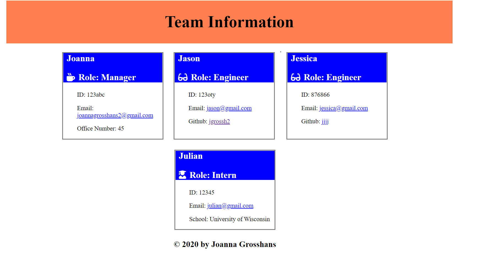

# Team-Information

## Description

Team Information application was created in order to organize a team of employees. The application starts with prompts for the manager's information, including name, ID, email, and office number. Then the user is directed to a menu of choices to either "add an engineer", "add an intern", or to generate the HTML team information file. Upon selecting "add an engineer", the user is prompted to enter the engineer's name, ID, email, and Github username. Upon selecting "add an intern", the user is prompted to enter the intern's name, ID, email, and school. The email and Github entries are displayed in the HTML as links to open and send an email, or view the Github profile, respectively. Please watch the following video for demonstration of the application.[screencastify Readme-generate](https://drive.google.com/file/d/139rWasnehmKHMCJDNQ9dB0TwiucsFiLr/view).

## Images 
  

## Installation
    Node, NPM install inquirer and jest
## Usage
    for personal use, run "node Index.js" in the command line
## License
    none
## Contributors
    Joanna Grosshans, creator
## Tests
    Enter "npm run test" in command line to run the test suite. Tests can be found in the __tests__ folder for functionality of receiving information for the Employee, Manager, Engineer, and Intern. 
## Questions
jgrossh2  
[GitHub](https://github.com/jgrossh2/team-information)  
Please contact <joannagrosshans2@gmail.com> for additional Information.

# Technologies used
* HTML 
* CSS 
* JS  
* Node  
* Bootstrap 

 